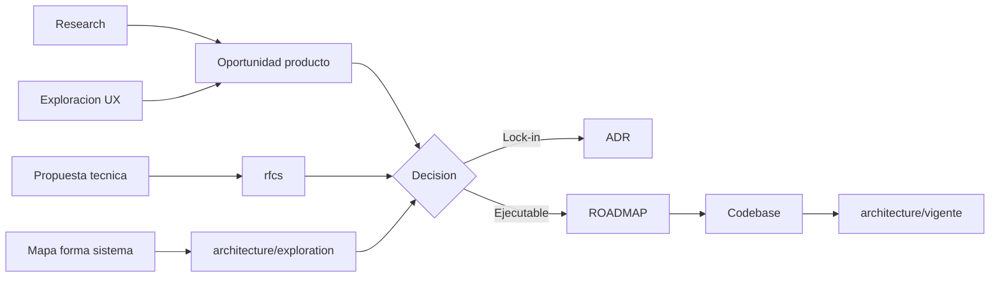

# Guía de organización de `docs/`

> **docs-kit:** v0.1.0

Este árbol separa **exploración**, **decisiones** y **convenciones de implementación** para no mezclar ideas con estándares oficiales.

## Qué va en cada carpeta

- `analysis/`: diagnóstico as-is, journey, evidencia de investigación.
- `design/`: exploración UX **conceptual** (copy, mockups, hipótesis). **Sin implementación** — approach técnico en [`rfcs/`](rfcs/); patrón en uso en `architecture/vigente/` o convención en `devs/`. Índice: [`design/README.md`](design/README.md).
- `exploration/`: ideas **sin validar** (producto, técnica o mixtas).
- `rfcs/`: propuestas técnicas **elaboradas** (approach, tradeoffs, decisión). Pueden existir sin estar en el ROADMAP. Índice: [`rfcs/README.md`](rfcs/README.md).
- `ADRs/` (o `ADRs — Foundations/`): decisiones formales del proyecto, difíciles de revertir.
- `devs/`: convenciones operativas para construir (git, codestyle, proceso de entrega).
- `domain/`: hechos y reglas del **mundo externo** (negocio, proveedor, dominio). **Sin** menciones de alcance MVP ni de cómo lo implementa la app (eso vive en ROADMAP / product / RFC). Índice: [`domain/README.md`](domain/README.md).
- `knowledge/`: criterio experto de uso / recomendación (no es spec de código).
- `research/`: feedback y aprendizaje desde validación con usuarios.
- `product/`: oportunidades de producto **validadas**, aún no comprometidas en ROADMAP.
- `architecture/`: forma del sistema y patrones. Índice: [`architecture/README.md`](architecture/README.md):
  - `architecture/vigente/`: patrones **ya en el codebase**.
  - `architecture/exploration/`: mapa / forma del sistema (etapas transversales). Approach por capacidad → [`rfcs/`](rfcs/).

## Regla de clasificación rápida

Si el documento responde:

| Pregunta | Carpeta |
|----------|---------|
| ¿Qué decidimos oficialmente y por qué? | `ADRs/` |
| ¿Cómo lo implementamos en el codebase (convención)? | `devs/` |
| ¿Qué estamos explorando en UX? | `design/` |
| ¿Qué entendimos del problema real? | `analysis/` o `research/` |
| ¿Cómo funciona el mundo externo / el negocio? | `domain/` |
| ¿Qué approach técnico proponemos para una capacidad? | `rfcs/` |
| ¿Qué patrón usa el código hoy? | `architecture/vigente/` |
| ¿Cómo evoluciona la forma del sistema (mapa)? | `architecture/exploration/` |
| ¿Idea aún sin validar? | `exploration/` |
| ¿Capacidad validada, aún no comprometida? | `product/` |
| ¿Qué vamos a ejecutar sí o sí? | `ROADMAP.md` |

## Dimensiones paralelas → ROADMAP

El `ROADMAP.md` contiene **solo** trabajo decidido para ejecutar.

- Sin validar → `exploration/`
- Producto validado → `product/`
- Approach técnico → `rfcs/`
- Mapa de forma del sistema → `architecture/exploration/`
- Patrón ya shippeado → `architecture/vigente/`

## Convención: no versionar ideas con el número de release

`design/`, `analysis/`, `research/`, `exploration/`, `rfcs/` y `architecture/exploration/` **no** llevan número de release en el **nombre** del archivo (`persistencia-0-4` ❌). El número vive en `ROADMAP.md` / CHANGELOG. Tras shippear, se puede citar un tag (`v0.3.0`) como hecho histórico.

## Mapa de adopción en este repo (listadedeseos)

La taxonomía vino de `agent-scripts/docs-kit` v0.1.0. Docs existentes reubicados al adoptar:

| Doc original | Carpeta destino | Por qué |
|--------------|----------------|---------|
| `happy-path.md` | `rfcs/happy-path.md` | approach de identificación del invitado (opciones + tradeoffs) |
| `protocolo-import-whatsapp.md` | `rfcs/protocolo-import-whatsapp.md` | protocolo técnico de import |
| `exploraciones/001-lista-preseleccionada.md` | `rfcs/001-lista-preseleccionada.md` | decisión de approach (localStorage vs query param vs cookie) |
| `handoff-creativo.md` | `design/handoff-creativo.md` | UX conceptual, sin implementación |
| `diseno-pagina-hoja-de-ruta.md` | `design/diseno-pagina-hoja-de-ruta.md` | diseño de página, conceptual |
| `copy-ideas.md` | `design/copy-ideas.md` | lluvia de copy, tono (UX) |
| `limitaciones-conocidas.md` | `architecture/vigente/limitaciones-conocidas.md` | comportamiento vigente en el codebase |
| `proceso-producto.md` | `devs/proceso-producto.md` | convención operativa del proceso |
| `playbook.md` | `devs/playbook.md` | diario de proceso / devs |
| `playbook-criteria.md` | `devs/playbook-criteria.md` | criterio de profundización, devs |
| `feedback/` | `research/feedback/` | feedback de usuarios = research |

