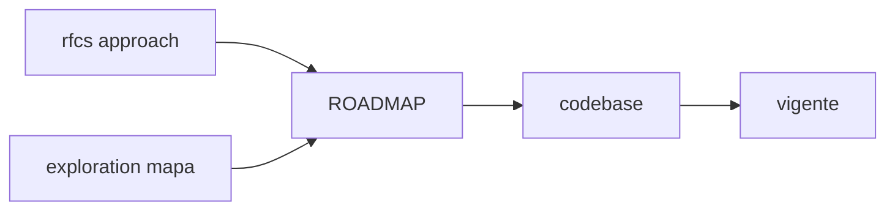

# Arquitectura técnica

Forma del sistema y patrones. Las propuestas de approach por capacidad viven en [`../rfcs/`](../rfcs/), no aquí.

## Subcarpetas

| Subcarpeta | Pregunta | Naturaleza |
|------------|----------|------------|
| [`vigente/`](vigente/) | ¿Qué patrón **usa el codebase hoy**? | Referencia para mantener código |
| [`exploration/`](exploration/) | ¿Cómo **evoluciona la forma del sistema**? | Mapa sin compromiso; no normativo |

## Promoción

1. Approach en `rfcs/` (o mapa en `exploration/`).
2. ROADMAP → implementación → documentar en `vigente/`.
3. RFC → estado `implementado` (historial).
4. Lock-in → ADR.
