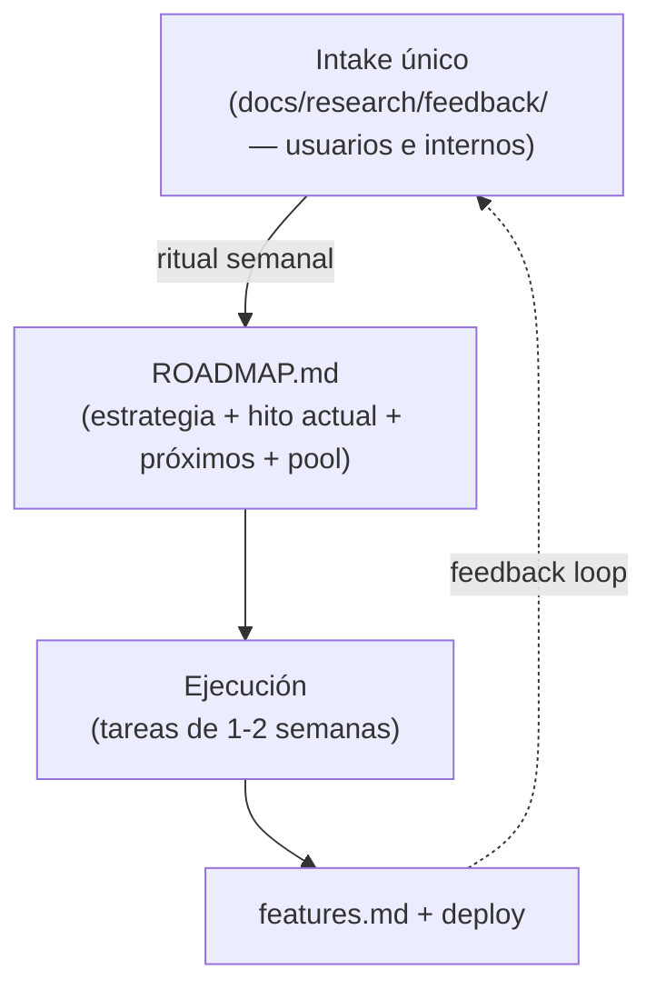
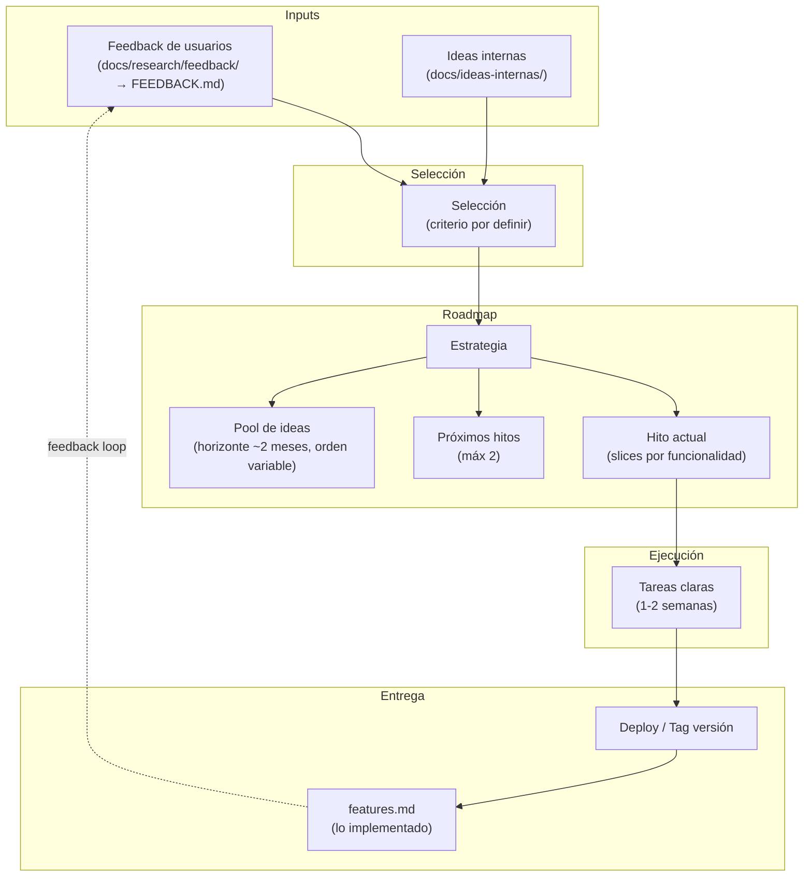

# Proceso de Producto

## Proceso vigente



## Flujo

1. **Llega feedback** — de usuarios o del equipo (fuente `interno-<autor>`), todo a `docs/research/feedback/`.
2. **Ritual semanal**: se revisa `docs/ROADMAP.md` completo — se mueven candidatos al pool, se purgan ideas estancadas, se marcan slices del hito actual y, si se completó, se promueve el próximo hito.
3. **Se ejecutan tareas** de 1-2 semanas para el hito actual.
4. **Se entrega**: deploy + fila nueva en `docs/features.md`.
5. El feedback sobre lo entregado vuelve como input nuevo (loop).

El criterio de selección, la definition of ready y el checklist del ritual están documentados en `docs/ROADMAP.md`, no acá — este archivo describe el proceso, `ROADMAP.md` es el que se opera semana a semana.

## Hoyos del proceso (historial)

| Hoyo | Pregunta original | Estado |
|---|---|---|
| **Criterio de selección** | ¿Qué hace que una idea entre al roadmap vs se quede en el pool? ¿Quién decide? | Resuelto — ver "Criterio de selección" en `docs/ROADMAP.md` |
| **Frecuencia de ciclo** | ¿Cada cuánto se hace el proceso completo? ¿Semanal, quincenal? | Resuelto — ritual semanal, ver `docs/ROADMAP.md` |
| **Ideas internas: formato** | ¿Mismo formato que feedback o algo más liviano? | Resuelto — fusionado en `docs/research/feedback/`, fuente `interno-<autor>` |
| **Pool: límite de capacidad** | ¿Cuántas ideas máx en el pool? ¿Cuándo se purgan? | Resuelto — máx 15 ítems, purga en el ritual semanal si llevan +2 meses sin subir de prioridad |
| **Slicing de hitos** | ¿Quién define los slices? ¿Cómo se decide el tamaño de cada slice? | Resuelto — máx 5 slices, se definen recién al promover del pool (ver definition of ready en `docs/ROADMAP.md`) |
| **Feedback loop** | ¿Cómo vuelve al usuario lo que implementamos? (changelog público, email, etc.) | Abierto a propósito — con la base actual de usuarios alcanza con contarle directo a quien dio el feedback; formalizar un canal sería proceso antes de necesidad |
| **features.md actualizado** | ¿Quién lo actualiza y en qué momento exacto? | Resuelto — en el paso 3 del ritual semanal, no al deployar ni al taggear |

## Historia del proceso

Lo que sigue registra cómo se llegó al proceso vigente: la primera propuesta, el análisis crítico que recibió, la simplificación resultante, y dos rondas de afinación tras ejecutarla. Se conserva como contexto de por qué el proceso es como es — no hace falta leerlo para operar el proceso semana a semana.

### Diagrama original (descartado)



### Flujo original

1. **Llegan inputs** — feedback de usuarios (`docs/research/feedback/`) e ideas del equipo.
2. **Se selecciona** qué entra al roadmap (criterio pendiente de definir).
3. **El roadmap se organiza** en estrategia, hito actual (sliced), hitos siguientes (~2) y un pool de ideas para ~2 meses que puede reordenarse en cualquier momento.
4. **Se ejecutan tareas** concretas para 1-2 semanas.
5. **Se entrega** con deploy o tag de versión.
6. **Se registra** en `features.md` lo implementado.
7. El ciclo se repite.

### Análisis (feedback de producto)

Evaluación del proceso propuesto: qué mantendría, qué sacaría y qué le falta para funcionar en la práctica.

#### Lo que dejaría (y por qué)

- **Un solo embudo de entrada.** Feedback de usuarios e ideas internas convergen en un mismo lugar antes del roadmap. Es la decisión correcta: evita tener dos backlogs compitiendo por prioridad. La alternativa (cada fuente con su propio camino a "hecho") es de lo primero que se rompe en equipos chicos.
- **Separar "hito actual" de "próximos hitos" de "pool".** Esto es el principio ágil de *rolling wave planning*: solo el trabajo más cercano necesita detalle (sliced), lo próximo necesita dirección, y lo lejano solo necesita existir en una lista. Planificar en detalle algo a 2 meses es trabajo que se va a botar.
- **Tope de "máx 2" próximos hitos.** Un límite explícito de cuánto planificas a futuro es, en esencia, un WIP limit aplicado a planificación. Bien puesto.
- **Pool reordenable en cualquier momento.** Coincide con cómo debería comportarse un backlog real: no es una cola FIFO, es una lista viva que cambia de orden según lo que se aprende.
- **`features.md` como registro de lo entregado.** Barato de mantener y responde "¿qué construimos y cuándo?" sin depender de memoria o de reconstruir desde git log.
- **Que el documento tenga su propia sección de "hoyos".** Es señal de buen criterio: reconocer lo que falta en vez de simular que el proceso está completo.

#### Lo que sacaría o simplificaría

- **"Selección" no debería ser una caja/etapa formal en el diagrama.** Tal como está dibujado, parece un paso del pipeline con su propio artefacto — pero en la práctica es una decisión periódica ("¿qué priorizamos hoy?"), no algo que produce un output distinto de "entra al pool o no". Yo lo convertiría en un *ritual* (ver más abajo) en vez de una etapa con nombre propio. Menos cajas en el diagrama, misma función.
- **Dos formatos paralelos casi idénticos (`feedback/` e `ideas-internas/`).** Mismo formato de archivo (`YYYY-MM-DD-fuente.md`), mismo propósito (alimentar el pool), dos READMEs a mantener. Para el tamaño actual del equipo, yo los fusionaría en un solo intake con un campo `fuente: usuario | interno` en cada entrada. Dos sistemas idénticos con nombres distintos es mantenimiento duplicado sin beneficio real.
- **"Estrategia" como caja separada dentro de Roadmap, si no se va a escribir en ningún lado.** Si "Estrategia" no tiene un documento vivo detrás, es una etapa decorativa. O se sostiene con algo concreto (un párrafo que se revisa cada cierto tiempo) o se elimina del diagrama — una caja que nadie actualiza termina desconectada de la realidad, que es peor que no tenerla.
- **"Deploy / Tag versión" como paso formal**, solo si en la práctica no versionan por tags — si el flujo real es deploy continuo a `main`, esta caja agrega ceremonia que nadie sigue. Simplificar a lo que de verdad pasa.

#### Lo que falta (y es más importante que lo anterior)

- **Cadencia del ciclo.** Ya está en la tabla de hoyos, pero lo subrayo: un proceso de decisión sin una cadencia fija (semanal, quincenal) no es un proceso, es algo que se hace "cuando alguien se acuerda". Esto es más urgente de resolver que cualquier otra cosa en el documento — sin ritmo, el pool crece y nunca se re-evalúa.
- **Criterio de selección concreto, aprovechando lo que ya se registra.** Ya cuentan ocurrencias de cada feature en `FEEDBACK.md`. Ese número es, de hecho, el criterio de selección de facto — solo falta declararlo explícitamente: por ejemplo, "entra al hito actual lo que tiene más ocurrencias entre las fuentes + encaje con la estrategia del momento". No se necesita un framework de scoring elaborado (RICE, etc.) para un equipo así de chico; basta con nombrar la regla que ya se usa implícitamente.
- **Definition of ready antes de pasar del pool al hito actual.** Ahora mismo el diagrama va de "pool" a "hito actual" (vía `E`) sin ningún filtro intermedio de "¿esta idea está lo bastante clara para convertirse en tareas de 1-2 semanas?". Sin esto, el riesgo es meter al hito algo que todavía es una idea vaga y descubrir a mitad de sprint que falta definirla.

#### Un problema estructural en el diagrama

La flecha `C --> D` (Selección → Estrategia) probablemente está mal dirigida. Lo seleccionado normalmente debería entrar al **pool** (`G`), no definir la estrategia directamente — la estrategia cambia con mucha menor frecuencia que las ideas individuales que se seleccionan. Si la intención real es "casi todo lo seleccionado engorda el pool, y solo ocasionalmente algo reformula la estrategia", el diagrama debería reflejar `C --> G` como el camino principal, con `C --> D` como excepción rara (o directamente sin flecha, dejando que sea el humano quien de vez en cuando actualice `D` a mano).

#### Resumen

El esqueleto (inputs → selección → roadmap por horizontes → ejecución → entrega → feedback loop) es sólido y sigue buenas prácticas ágiles de planificación por olas y límites de WIP. El principal riesgo no es que sobren o falten cajas — es que el documento describe una *estructura* pero no un *ritmo*: sin cadencia fija ni criterio de selección explícito, el proceso no se va a ejecutar solo por estar dibujado. Resolver esos dos hoyos vale más que pulir el diagrama.

### Propuesta de simplificación (accionable)

El análisis anterior diagnostica; esta sección prescribe. La idea central: **reducir el proceso a 2 artefactos + 1 ritual**. Todo lo demás (diagramas, etapas, subgrafos) es descripción, no proceso.

#### El proceso simplificado


Cambios respecto al diagrama original:

1. **"Selección" deja de ser etapa y pasa a ser ritual.** La selección es lo que *ocurre durante* la revisión semanal del roadmap, no una caja con output propio. La etiqueta de la flecha (`ritual semanal`) reemplaza al subgrafo completo.
2. **"Estrategia", "hito actual", "próximos hitos" y "pool" se colapsan en un solo archivo: `ROADMAP.md`.** Son 4 secciones de un documento, no 4 nodos de un proceso. Mantenerlas como cajas separadas sugiere que viven en lugares distintos — y ahí es donde se desincronizan.
3. **`ideas-internas/` se fusiona con `feedback/`.** Un solo intake; la fuente se declara en el nombre del archivo (`2026-07-07-camila.md`, `2026-07-08-interno-tomas.md`).
4. **Entrega se reduce a "deployar + anotar en features.md".** Sin caja intermedia de tag: si algún día se versiona por tags, se agrega al checklist del ritual, no al diagrama.

#### Lo que debe existir pero sigue ambiguo — instrucciones para crearlo

Cada ítem indica **qué crear, dónde, con qué contenido mínimo, y cuándo está listo**. Cualquier persona (o agente) puede ejecutarlos en orden; los dos primeros son prerequisito del resto.

##### 1. Crear `docs/ROADMAP.md` (el artefacto central — hoy no existe)

Es el hoyo más grande: el proceso entero orbita alrededor de un roadmap que no tiene archivo. Crear `docs/ROADMAP.md` con exactamente estas 4 secciones:

```markdown
# Roadmap

## Estrategia
<1-3 frases: a quién servimos y qué apostamos este trimestre. Si no cabe en 3 frases, no es estrategia, es backlog.>

## Hito actual
**Nombre del hito** — <resultado observable por el usuario cuando esté listo>
- [ ] slice 1 (entregable por sí solo)
- [ ] slice 2
<máx 5 slices; si necesitas más, el hito es muy grande>

## Próximos hitos (máx 2)
1. <nombre + 1 frase de intención — SIN slices, se detallan recién al promoverse>
2. <ídem>

## Pool
<lista con viñetas, ordenada por prioridad descendente; máx 15 ítems; cada ítem = 1 línea + link al feedback que lo originó>
```

**Hecho cuando:** el archivo existe, el hito actual tiene slices marcables, y cada ítem del pool referencia su origen en `docs/research/feedback/`.

##### 2. Definir el ritual semanal (la cadencia — hoy inexistente)

Agregar al final de `ROADMAP.md` una sección `## Ritual semanal` con este checklist (día fijo, ~30 min, quien tenga el rol de producto — hoy Tomás):

1. Leer feedback nuevo en `docs/research/feedback/` y actualizar `FEEDBACK.md` (ocurrencias).
2. Mover candidatos al **pool** (no directo al hito). Purgar del pool lo que lleve >2 meses sin subir de prioridad.
3. Revisar el **hito actual**: marcar slices hechos. Si el hito se completó → registrar en `features.md`, promover el próximo hito y slicearlo recién ahí.
4. Releer la **estrategia** (30 segundos). Solo se reescribe si hubo un aprendizaje que la contradiga — no cada semana.

**Hecho cuando:** el checklist está en el archivo y se ejecutó al menos una vez con fecha anotada (`Última revisión: YYYY-MM-DD` al inicio del archivo).

##### 3. Declarar el criterio de selección (1 párrafo, no un framework)

Escribir en `ROADMAP.md`, bajo el ritual, la regla que ya se usa de facto:

> Del pool sube lo que combine: (a) más ocurrencias en `FEEDBACK.md`, (b) encaje con la estrategia vigente, (c) quepa en 1-2 semanas de trabajo. Empates los resuelve el rol de producto. Una idea sin encaje estratégico no sube por muchas ocurrencias que tenga — se anota como señal para revisar la estrategia.

**Hecho cuando:** el párrafo existe y la primera promoción pool→hito lo cita como justificación.

##### 4. Definir "listo para entrar al hito" (definition of ready mínima)

Tres preguntas antes de promover algo del pool; si alguna es "no", la idea vuelve al pool con una nota de qué falta:

- ¿Puedo describir el resultado desde la perspectiva del usuario en 1 frase?
- ¿Sé cómo verificar que funciona (aunque sea manualmente)?
- ¿Cabe en 1-2 semanas? Si no, ¿cuál es el primer slice que sí?

**Hecho cuando:** las 3 preguntas están en `ROADMAP.md` junto al criterio de selección.

##### 5. Crear `docs/features.md` (hoy referenciado pero inexistente)

Formato: tabla append-only, una fila por entrega, se escribe en el paso 3 del ritual (no "al deployar" ni "al taggear" — al revisar; así nunca depende de acordarse en medio de un deploy):

```markdown
| Fecha | Feature | Origen | Hito |
|---|---|---|---|
| 2026-07-07 | Selector de lista al crear/editar deseo | feedback/2026-07-07-camila.md | — |
```

**Hecho cuando:** el archivo existe con las features ya entregadas hasta hoy (reconstruir desde `playbook.md` y git log).

##### 6. Fusionar `ideas-internas/` en `feedback/`

- Mover los archivos de `docs/ideas-internas/` a `docs/research/feedback/` renombrando a `YYYY-MM-DD-interno-<autor>.md`.
- Actualizar `docs/research/feedback/README.md`: una línea que diga que la fuente `interno-*` marca ideas del equipo.
- Borrar `docs/ideas-internas/`.

**Hecho cuando:** el directorio ya no existe y el README menciona la convención.

#### Qué preguntas de la tabla de hoyos quedan resueltas

| Hoyo | Resuelto por |
|---|---|
| Criterio de selección | Instrucción 3 |
| Frecuencia de ciclo | Instrucción 2 (semanal) |
| Ideas internas: formato | Instrucción 6 (fusión) |
| Pool: límite de capacidad | Instrucción 1 (máx 15) + purga en instrucción 2 |
| Slicing de hitos | Instrucción 1 (máx 5 slices, se slicea al promover) + instrucción 4 |
| Feedback loop | **Sigue abierto** — decidir canal de vuelta al usuario cuando haya más de un puñado de usuarios; hoy alcanza con contarle directo a quien dio el feedback |
| features.md actualizado | Instrucción 5 (en el ritual, paso 3) |

La única pregunta que se deja abierta a propósito es el canal del feedback loop hacia usuarios: con la base actual de usuarios, formalizarlo sería proceso antes de necesidad.

### Afinación (ronda 2) — revisión de lo ejecutado

Revisé los resultados de la ejecución de las 6 instrucciones (cambios sin commitear al 2026-07-08). Veredicto general: **la estructura quedó bien** — `ROADMAP.md` existe con sus secciones, `features.md` existe, `ideas-internas/` fue fusionada correctamente y los supuestos del ejecutor quedaron marcados `[borrador]` en vez de disfrazados de decisión, lo cual es exactamente el comportamiento correcto. Pero hay 6 desviaciones o cabos sueltos. Instrucciones para quien ejecute esta ronda (no hace falta contexto previo; cada ítem es autocontenido):

##### A. Actualizar la cabecera de este documento (la desviación más visible)

El diagrama y la sección "Flujo" al inicio de este archivo describen el proceso **viejo**: referencian `docs/ideas-internas/` (directorio que ya no existe) y dicen "criterio por definir" (ya está definido en `ROADMAP.md`). Un lector nuevo que abra este documento leerá primero el proceso obsoleto.

- Reemplazar el diagrama inicial y la sección "Flujo" por el diagrama de "El proceso simplificado" (más abajo en este mismo archivo) y un flujo de 4 pasos que lo acompañe.
- Convertir la tabla "Hoyos del proceso" en histórica: agregarle una columna "Estado" usando la tabla "Qué preguntas quedan resueltas" como fuente, o moverla a una sección "Historia" al final.
- No borrar las secciones de análisis ni de propuesta: son el registro de por qué el proceso es como es. Pero deben quedar claramente *después* de la descripción del proceso vigente.

**Hecho cuando:** lo primero que ve un lector es el proceso actual, y ninguna parte del documento referencia `docs/ideas-internas/` como algo existente.

##### B. Completar `docs/features.md` (quedó incompleto)

La instrucción 5 decía reconstruir desde `playbook.md` **y git log**; solo se usó el playbook. Faltan al menos estas entregas visibles al usuario, todas del 2026-07-07 (verificar con `git log --oneline`):

- Recordar la última lista seleccionada al crear un deseo (`9dd1beb`, ver `docs/rfcs/001-lista-preseleccionada.md`)
- Separar el estado "cumplido" de las opciones del deseo (`2c9b7f7`)
- Mejorar labels y checkboxes del formulario de deseo (`dc1ed29`)
- Ordenar la lista default por fecha descendente (`83183be`)

**Hecho cuando:** cada commit `feat:`/`fix:` con efecto visible para el usuario tiene su fila en la tabla.

##### C. Corregir el slice 1 del hito actual en `ROADMAP.md`

El primer slice dice "Elegir método (magic link / código / identifier-first)". Eso es una **decisión**, no un slice entregable — viola la propia plantilla ("entregable por sí solo"). Sacarlo de la lista de checkboxes y ponerlo como nota previa al hito ("Decisión pendiente: método de identificación — opciones B, C, E de `docs/rfcs/happy-path.md`"). Los slices restantes deben redactarse como resultados observables por el usuario, no como pasos técnicos.

**Hecho cuando:** todos los checkboxes del hito describen algo que un usuario podría notar al usarlo.

##### D. Mover "Última revisión" al inicio de `ROADMAP.md`

La instrucción 2 pedía `Última revisión: YYYY-MM-DD` **al inicio del archivo** (es lo primero que quieres ver al abrirlo: ¿está fresco o abandonado?). Quedó enterrada dentro de la sección "Ritual semanal". Moverla a la línea siguiente al título `# Roadmap`.

**Hecho cuando:** la fecha de última revisión es visible sin scroll.

##### E. Corregir el conteo de ocurrencias en "Próximos hitos"

Los próximos hitos dicen "3 ocurrencias agrupadas" y "2 ocurrencias agrupadas". Es incorrecto: según `FEEDBACK.md`, son 3 (y 2) **ideas distintas de una misma fuente** (Camila), cada una con 1 ocurrencia. Ocurrencia = la misma idea repetida por fuentes distintas; ideas hermanas de un clúster no suman ocurrencias. Si esto no se corrige, el criterio de selección (que pondera ocurrencias) nace distorsionado. Reemplazar por: "clúster de 3 ideas, 1 fuente".

**Hecho cuando:** ninguna línea del roadmap infle ocurrencias sumando ideas de un mismo clúster.

##### F. Arreglar la referencia rota en `docs/research/feedback/README.md`

El paso 2 de la sección "Proceso" dice "Actualizar `CONSOLIDADO.md`" — ese archivo no existe; el real es `FEEDBACK.md`. Preexistente a esta ronda, pero ahora que es el README del intake único, es el único lugar que documenta el proceso de entrada y apunta a un archivo fantasma. Cambiar `CONSOLIDADO.md` → `FEEDBACK.md`.

**Hecho cuando:** el README no menciona archivos inexistentes.

##### G. (Humano, no ejecutor) Primera corrida del ritual

Los `[borrador]` de `ROADMAP.md` (estrategia, hito actual, próximos hitos) son supuestos del ejecutor, no decisiones. No los puede resolver otro agente: requiere que el rol de producto (Tomás) corra el ritual semanal por primera vez, confirme o corrija esas secciones, quite las marcas `[borrador]` y anote la fecha en "Última revisión". Hasta que eso no pase, el roadmap es una hipótesis, no un plan.

**Hecho cuando:** no queda ninguna marca `[borrador]` y "Última revisión" tiene fecha.

### Afinación (ronda 3) — ejecución de la ronda 2

Ejecutados A–F el 2026-07-08:

- **A**: cabecera de este documento reescrita — el proceso vigente (2 artefactos + 1 ritual) va primero; el diagrama y flujo originales pasaron a "Historia del proceso"; la tabla de hoyos ahora tiene columna "Estado".
- **B**: `docs/features.md` completado con las 4 entregas que faltaban (recordar última lista, separar estado cumplido, mejorar labels/checkboxes, ordenar por fecha descendente).
- **C**: el slice "elegir método" del hito actual se convirtió en una nota de "decisión pendiente" separada de los slices; los 3 slices restantes quedaron redactados como resultado observable por el usuario.
- **D**: "Última revisión" movida a la segunda línea de `ROADMAP.md`, justo bajo el título.
- **E**: corregido el conteo — los próximos hitos ahora dicen "N ideas de 1 fuente" en vez de "N ocurrencias agrupadas", para no inflar el criterio de selección.
- **F**: `docs/research/feedback/README.md` ya no referencia `CONSOLIDADO.md`; dice `FEEDBACK.md`.

**Refuerzo adicional no pedido explícitamente, agregado por consistencia con "que el proceso no falle":** el Pool de `ROADMAP.md` no tenía fecha de entrada por ítem, lo que hacía inaplicable la regla de purga del ritual semanal ("+2 meses sin subir de prioridad" — sin fecha, nada que comparar). Se agregó `(pool desde YYYY-MM-DD)` a cada ítem existente y una nota que instruye actualizar esa fecha al reordenar o promover un ítem.

**G sigue pendiente** — requiere al rol de producto, no a un ejecutor.
