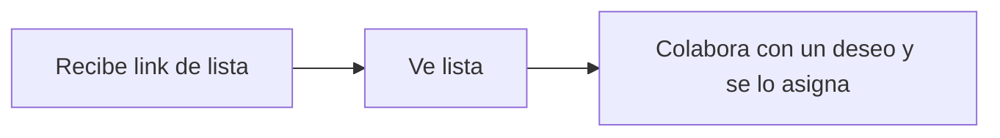

# Happy Path

1. Usuario recibe link de lista
2. Usuario ve lista
3. Usuario decide colaborar con un deseo y se lo asigna

## Preguntas abiertas

Para que el usuario se asigne un deseo, hay que identificarlo de alguna forma. Opciones:

### A. Registro clásico (email + password / OAuth)
- **Fricción**: alta. El usuario llega con un link y de repente le pedimos registrarse.
- **¿Dónde pedirlo?**: Lo más tarde posible. Dejar que explore la lista, vea los deseos, entienda el valor. Recién cuando quiera asignarse uno, pedirle registrar.
- **Límite de exploración sin registro**: ver la lista completa, ver detalles de deseos, incluso ver quién más ha colaborado. Todo eso construye contexto y motivación. El registro se pide en el paso 3 (asignarse el deseo).

### B. Magic link / email-only
- Menos fricción que registro completo. El usuario ingresa su email, recibe un link y queda autenticado.
- Mismo punto de entrada: al querer asignarse un deseo.

### C. Código de verificación (2 clicks)
- Similar a magic link pero sin email: se genera un código corto en pantalla y el usuario lo confirma (ej. "¿Eres tú? Sí, soy yo").
- No requiere email ni password. Identifica por cookie/device ID.
- **Riesgo**: no hay recuperación de cuenta si pierde el dispositivo.

### D. Sin identificación (token efímero)
- El link de lista contiene un token de "colaborador anónimo". El usuario se asigna deseos sin registrarse.
- **Problema**: si pierde el link, pierde acceso a sus asignaciones. No hay cuenta a la que recurrir.

### E. Paso intermedio: identifier first
- Pedir solo un identificador mínimo (nombre de usuario corto + cookie). Sin password. Más adelante si quiere "recuperar" sus asignaciones, puede agregar email.
- Baja fricción inicial, con opción de upgrade.

## Riesgo: el compromiso no se cumple

Asignarse un deseo no garantiza que el regalo llegue el día del evento.

### Prevención (antes del evento)

- **Recordatorios automáticos**: "Faltan X días para el evento, ¿ya tienes el regalo de [deseo]?"
- **Cierre de asignaciones**: N días antes del evento, las asignaciones se "cierran". El creador ve claramente quién confirmó y quién no.
- **Doble confirmación**: Asignar es provisional. El usuario debe luego "confirmar" que efectivamente llevará el regalo. Hasta que no confirma, el deseo aparece como "asignado (pendiente de confirmar)".

### Mitigación (el día del evento)

- **Estado visible**: El creador ve una tabla con cada deseo y su estado: "Disponible / Asignado a X (confirmado) / Asignado a X (sin confirmar)".
- **Re-apertura**: Si el asignado no aparece, el creador puede re-abrir el deseo para que otro invitado lo tome.

### A futuro

- **Reputación**: historial de cumplimiento por usuario.
- **Pool de emergencia**: el creador agrega regalos genéricos de respaldo por si acaso.
