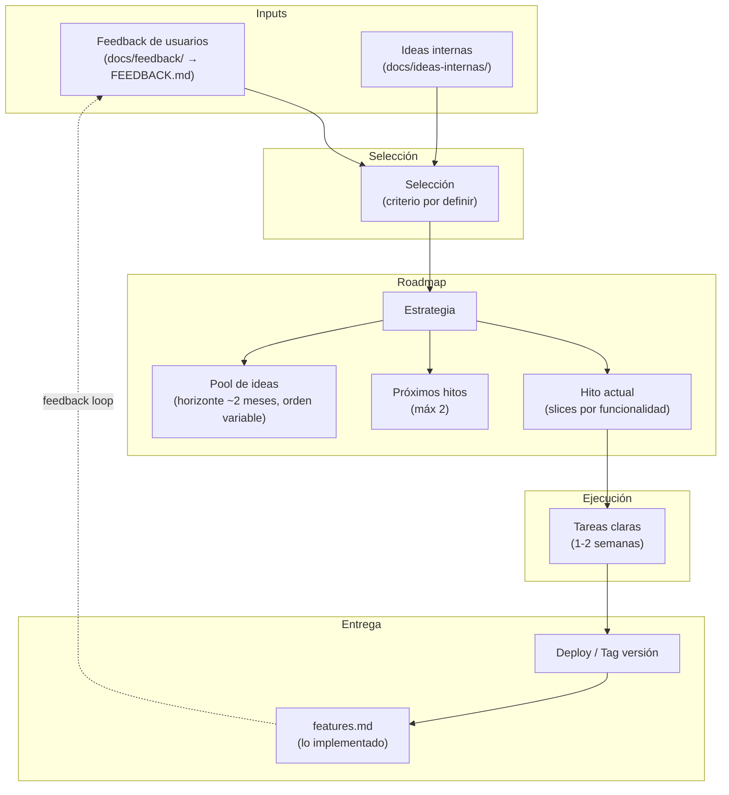

# Proceso de Producto

## Flujo

1. **Llegan inputs** — feedback de usuarios (`docs/feedback/`) e ideas del equipo.
2. **Se selecciona** qué entra al roadmap (criterio pendiente de definir).
3. **El roadmap se organiza** en estrategia, hito actual (sliced), hitos siguientes (~2) y un pool de ideas para ~2 meses que puede reordenarse en cualquier momento.
4. **Se ejecutan tareas** concretas para 1-2 semanas.
5. **Se entrega** con deploy o tag de versión.
6. **Se registra** en `features.md` lo implementado.
7. El ciclo se repite.

## Hoyos del proceso

| Hoyo | Pregunta abierta |
|---|---|
| **Criterio de selección** | ¿Qué hace que una idea entre al roadmap vs se quede en el pool? ¿Quién decide? |
| **Frecuencia de ciclo** | ¿Cada cuánto se hace el proceso completo? ¿Semanal, quincenal? |
| **Ideas internas: formato** | ¿Mismo formato que feedback (archivos fechados) o algo más liviano? |
| **Pool: límite de capacidad** | ¿Cuántas ideas máx en el pool? ¿Cuándo se purgan? |
| **Slicing de hitos** | ¿Quién define los slices? ¿Cómo se decide el tamaño de cada slice? |
| **Feedback loop** | ¿Cómo vuelve al usuario lo que implementamos? (changelog público, email, etc.) |
| **features.md actualizado** | ¿Quién lo actualiza y en qué momento exacto? ¿Al taggear o al deployar? |
